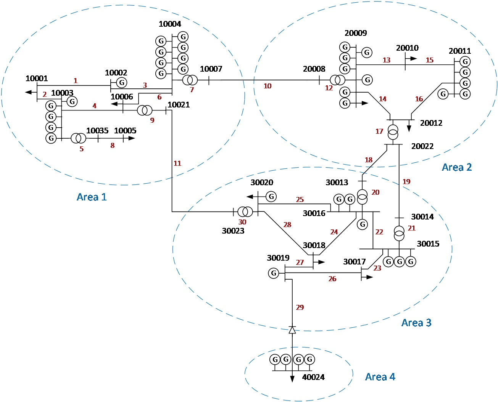

# 4-area-network
This repository contains the 4-area network for relaibility studies in MATPOWER and pandapower formats. The network is described in [article](https://www.sciencedirect.com/science/article/pii/S2352340920313779) and avaiable at [zenodo repository](https://zenodo.org/record/3491916#.YV65FflBzFc).

## Conversion code
There are two scripts for conversion.
  * convert_to_mat.m reads in csv files and saves mpc struct in a mat file.
  * convert_from_matpower_to_pp.ipynb reads in the mat file and saves the network in a pandapower json file.
